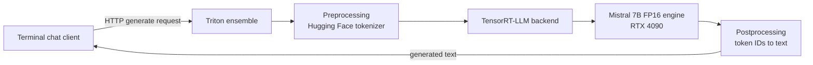

# Mistral 7B inference optimization with TensorRT-LLM and Triton

An end-to-end NVIDIA inference deployment project that establishes a
Hugging Face/PyTorch FP16 baseline, compiles the same model into a
TensorRT-LLM FP16 engine, serves it through NVIDIA Triton Inference Server,
and calls the deployment from a terminal chat client.

> **Measured result:** TensorRT-LLM increased single-request generation
> throughput from **32.62 to 62.82 tokens/s (1.93x)** and reduced mean latency
> from **3.924 to 2.038 seconds (48.1%)** on the same RTX 4090 pod.

## What this project demonstrates

- A controlled, apples-to-apples PyTorch-to-TensorRT-LLM benchmark with FP16
  precision, token counts, prompt, decoding, and hardware held constant.
- Compilation of `mistralai/Mistral-7B-Instruct-v0.3` into a hardware-specific
  TensorRT-LLM engine under a constrained RunPod memory budget.
- A Triton ensemble that owns tokenization, GPU execution, and detokenization
  behind one HTTP inference endpoint.
- Operational checks for server/model readiness plus a real client application
  that sends prompts through the deployed service.
- Honest separation between verified results and future work: FP8
  quantization, concurrent load testing, and production hardening are not
  claimed as complete.

| Phase | Deliverable | Status |
| --- | --- | --- |
| 1 | Reproducible Hugging Face/PyTorch FP16 baseline | Complete |
| 2 | TensorRT-LLM FP16 build and controlled benchmark | Complete |
| 3 | Triton ensemble, smoke test, and terminal client | Complete |
| Future | FP8 quality/performance study and concurrent serving | Not started |

## Architecture



The client only understands text and HTTP. It wraps each message in Mistral's
instruction format, while Triton owns the serving contract
and composes three models: preprocessing converts text to token IDs, the
TensorRT-LLM backend schedules and executes the compiled engine, and
postprocessing decodes output IDs. This boundary lets clients remain stable
while engine shapes, batching policy, or precision change behind the endpoint.

The engine is produced separately from the online serving path:


See [the architecture deep dive](docs/architecture.md) for request flow,
component responsibilities, design decisions, and production evolution.

## Benchmark

The benchmark was run on September 13, 2026. Both paths used the same physical
pod and workload so the comparison isolates the runtime/compiler change rather
than quantization or hardware differences.

| Controlled setting | Value |
| --- | --- |
| GPU | NVIDIA GeForce RTX 4090 (24 GB) |
| Container | `nvcr.io/nvidia/tritonserver:25.03-trtllm-python-py3` |
| Model | `mistralai/Mistral-7B-Instruct-v0.3` |
| Precision | FP16 on both paths |
| Workload | Batch 1, 28 input tokens, exactly 128 generated tokens |
| Decoding | Greedy; EOS ignored to keep output work constant |
| Samples | 3 warmups, then 10 measured runs |
| Timed region | Prompt prefill plus autoregressive decode; tokenization excluded |

| Metric | PyTorch FP16 | TensorRT-LLM FP16 | Change |
| --- | ---: | ---: | ---: |
| Mean latency | 3.924 s | 2.038 s | **48.1% lower** |
| Median latency | 3.918 s | 2.037 s | 48.0% lower |
| Latency standard deviation | 0.026 s | 0.001 s | 96.2% lower |
| Generation throughput | 32.62 tokens/s | 62.82 tokens/s | **1.93x** |
| Model/engine loading | 26.37 s | 40.28 s | 52.8% longer |

Throughput is `generated tokens / mean request latency`; speedup is
`TensorRT-LLM throughput / PyTorch throughput`. Engine loading is a one-time
startup cost that a persistent service amortizes. GPU memory is not compared
as a win because PyTorch's 13.53 GiB figure is peak allocator memory while
TensorRT-LLM's 15.39 GiB figure is total device memory in use.

The tracked [benchmark evidence](results/README.md) includes the captured
PyTorch run timings and the recorded TensorRT-LLM summary, with the evidence
status of each artifact stated explicitly.

## Verified demo

With Triton running, the smoke test verified both readiness endpoints and sent
a real generation request through the ensemble:

```text
$ python phase3/smoke_test.py
Triton server: ready
Ensemble model: ready

Response
An Inference Server is a software component that executes machine learning
models and makes predictions or inferences based on input data ...
```

The terminal chat client was also exercised against the same deployment. See
the [verified CLI transcript](docs/demo.md) and [Phase 3 runbook](phase3/README.md).
A text transcript is more useful than a terminal screenshot here because it is
searchable, accessible, and captures the exact commands and output.

## Repository layout

```text
.
├── baseline.py                 # Hugging Face/PyTorch reference benchmark
├── phase2/
│   ├── build_fp16_engine.py    # checkpoint conversion and engine build
│   ├── benchmark_engine.py     # controlled TensorRT-LLM benchmark
│   └── README.md               # engine-build decisions and runbook
├── phase3/
│   ├── prepare_model_repository.py
│   ├── serve.sh
│   ├── smoke_test.py
│   ├── chat.py
│   └── README.md               # Triton deployment runbook
├── docs/                       # architecture and demo evidence
├── results/                    # tracked benchmark records
└── scripts/runpod_env.sh       # RunPod CUDA/Hugging Face environment setup
```

Generated engines, downloaded weights, Triton model repositories, and scratch
logs are intentionally excluded from Git because they are large or
machine-specific.

## Reproduce on RunPod

### Prerequisites

- NVIDIA RTX 4090 with 24 GB VRAM (the measured hardware)
- At least 40 GiB system RAM and enough persistent disk for model weights,
  the intermediate checkpoint, and the approximately 14 GiB engine
- RunPod container image
  `nvcr.io/nvidia/tritonserver:25.03-trtllm-python-py3`
- A Hugging Face token with access to the selected model, if the repository
  requires authentication

TensorRT engines are tied to their TensorRT version and target GPU architecture.
Rebuild the engine when either changes.

### 1. Clone and configure the environment

```bash
cd /workspace
git clone https://github.com/PNair05/TritonLLMDeployment.git
cd TritonLLMDeployment
source scripts/runpod_env.sh
```

The pinned container already contains the benchmark dependencies. The helper
keeps the Hugging Face cache on the persistent `/workspace` volume and works
around a RunPod CUDA forward-compatibility library issue seen on this pod.

### 2. Measure the PyTorch baseline

```bash
mkdir -p outputs
python -u baseline.py \
  --warmup-runs 3 \
  --runs 10 \
  --max-new-tokens 128 \
  | tee outputs/mistral-7b-fp16-rtx4090-current-pod-batch1.txt
```

### 3. Build and benchmark the TensorRT-LLM engine

```bash
nohup python -u phase2/build_fp16_engine.py \
  > outputs/trtllm-fp16-build.txt 2>&1 &
tail -f outputs/trtllm-fp16-build.txt
```

After the build completes:

```bash
python phase2/benchmark_engine.py \
  --engine-dir artifacts/trtllm/fp16-engine \
  --warmup-runs 3 \
  --runs 10 \
  --max-new-tokens 128 \
  | tee outputs/trtllm-fp16-rtx4090-batch1.txt
```

See [Phase 2](phase2/README.md) for the memory-aware two-process build design
and benchmark interpretation.

### 4. Serve the engine through Triton

```bash
python phase3/prepare_model_repository.py
./phase3/serve.sh
```

Keep that terminal open. Once Triton reports all four models as `READY`, use a
second terminal on the same pod:

```bash
cd /workspace/TritonLLMDeployment
python phase3/smoke_test.py
python phase3/chat.py
```

If `prepare_model_repository.py` reports that the output already exists, do
not delete it unless you intentionally want to regenerate the repository. An
existing manifest plus HTTP 200 responses from Triton's server and ensemble
readiness endpoints means the generated repository is usable.

## Engineering decisions and tradeoffs

- **FP16 versus FP16:** keeping precision constant attributes the measured
  speedup to TensorRT-LLM compilation and runtime rather than quantization.
- **Same-pod comparison:** an earlier different-host result is excluded from
  the denominator because its framework and host environment differed.
- **Two-process build:** RunPod limited RAM to about 38.2 GiB while TensorRT's
  build phase peaked near 39.4 GB. The build script converts shards, releases
  converter memory, then replaces the process with `trtllm-build`.
- **Pinned CUDA stack:** the 25.03 container uses CUDA 12.8 and avoids the CUDA
  13 forward-compatibility failure observed with the pod's 570-series driver.
- **Benchmark-sized engine:** batch 1 and a 256-token maximum sequence make the
  result reproducible, but intentionally limit the first serving demo.

## Scope and limitations

This is a working inference optimization and deployment proof of concept, not
a production chat service. The current engine supports batch size 1, at most
128 input tokens, and 256 total tokens. It has no authentication, rate
limiting, streaming, multi-turn context, concurrent-load benchmark, time-to-
first-token measurement, or formal output-quality evaluation. FP8 calibration
and quantization remain future work. Those are the logical next experiments,
not completed features.
