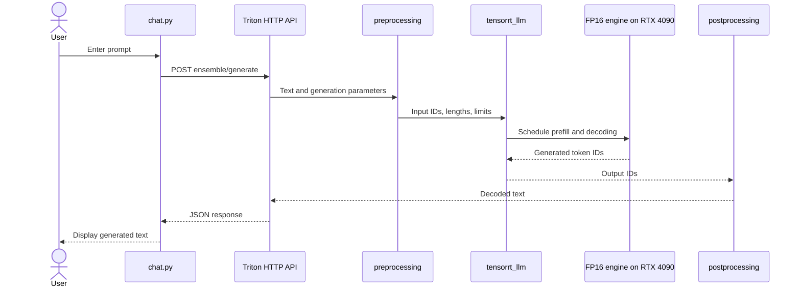
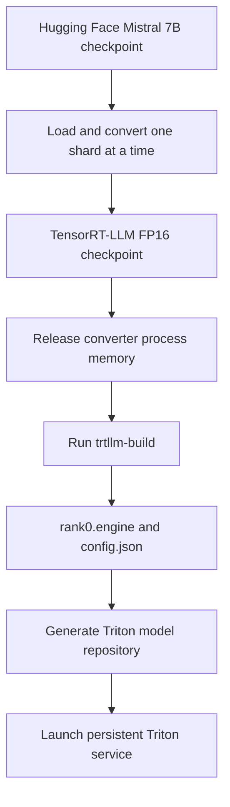

# Architecture

This deployment separates the application contract, model-serving workflow,
and optimized GPU execution. That separation is the central architectural
decision: a client should not need to know how a model is tokenized, compiled,
batched, or placed on the GPU.

## Runtime request path



### Application layer

`phase3/chat.py` is deliberately thin. It accepts a prompt, verifies that the
service is ready, and calls the Triton endpoint through `TritonClient`. It has
no local model weights or GPU dependency. A web UI, RAG pipeline, or another
service could replace it without changing the model repository.

### Serving layer

Triton exposes one `ensemble` model while coordinating three implementation
models:

- `preprocessing` applies the Hugging Face tokenizer to the instruction-formatted
  text supplied by the client.
- `tensorrt_llm` executes the engine with Triton's TensorRT-LLM backend and
  inflight-fused batching configuration.
- `postprocessing` decodes output token IDs and removes special tokens.

The generated repository is assembled from the templates shipped in NVIDIA's
pinned Triton container. `phase3/prepare_model_repository.py` fills in the
engine path, tokenizer path, batch limits, KV-cache policy, and model-specific
settings, then records them in `phase3-manifest.json`.

### Execution layer

The engine contains the TensorRT-LLM execution plan for Mistral 7B at FP16.
It is compiled for the measured RTX 4090 and the TensorRT 10.9 stack in the
Triton 25.03 container. It is not treated as a portable source artifact;
weights and build scripts are portable, but the engine must be rebuilt when
the target GPU architecture or TensorRT version changes.

## Build path



The two-stage process is operationally important. The pod had roughly 38.2
GiB of cgroup-limited RAM, while TensorRT reported a build-phase peak near
39.4 GB. Keeping the Hugging Face converter and TensorRT builder in one Python
process caused an out-of-memory failure. The build script instead serializes
the intermediate checkpoint, releases the converter, and replaces the process
with `trtllm-build` so the two peaks do not overlap.

## Why Triton is separate from TensorRT-LLM

TensorRT-LLM provides model compilation and optimized inference execution.
Triton provides a network-facing service, model lifecycle, readiness endpoints,
request scheduling, metrics, and composition through an ensemble. The project
benchmarks TensorRT-LLM directly in Phase 2 to measure engine performance, then
uses Triton in Phase 3 to turn that engine into an application-consumable
service.

## Why precision stays FP16

The controlled comparison changes one major variable: PyTorch execution is
replaced by TensorRT-LLM execution. Both paths retain FP16 precision. This
makes the 1.93x throughput result defensible as a compiler/runtime improvement;
an FP8 result would combine runtime and quantization effects unless evaluated
as a separate experiment.

## Generated model repository

```text
artifacts/triton/model-repository/
├── ensemble/
│   ├── 1/
│   └── config.pbtxt
├── preprocessing/
│   ├── 1/model.py
│   └── config.pbtxt
├── tensorrt_llm/
│   ├── 1/model.py
│   └── config.pbtxt
├── postprocessing/
│   ├── 1/model.py
│   └── config.pbtxt
└── phase3-manifest.json
```

This directory is generated on the GPU host and excluded from Git because it
contains environment-specific paths and copied container templates.

## Production evolution

The current build proves the path end to end, but its shape envelope is sized
for the benchmark. A production iteration would:

1. Build an engine for longer context and batch sizes greater than one.
2. Load-test concurrent clients and report p50, p95, p99, throughput, queue
   time, time to first token, and inter-token latency.
3. Enable streaming and test cancellation/backpressure behavior.
4. Add authentication, TLS, rate limiting, request validation, and observability.
5. Evaluate output quality before and after any FP8 quantization.
6. Package the server configuration as reproducible infrastructure rather than
   exposing an unauthenticated development port.
